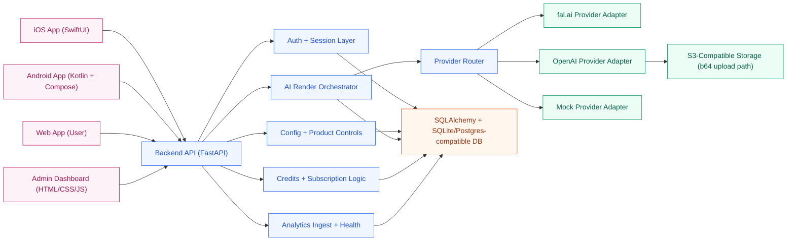
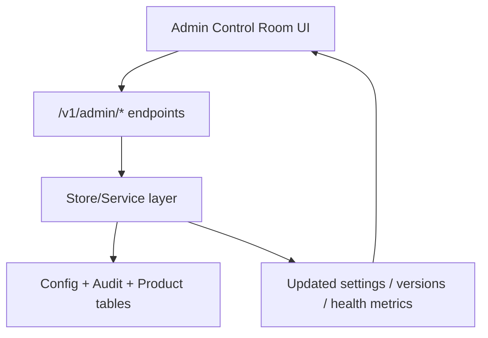
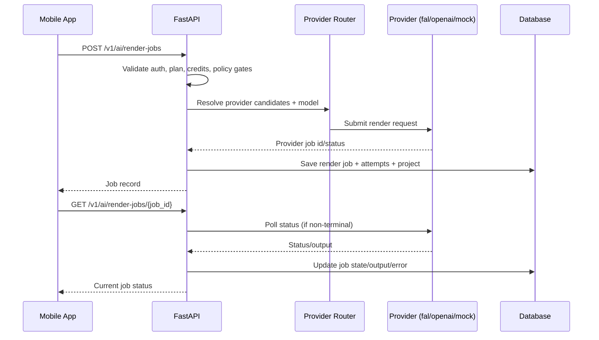
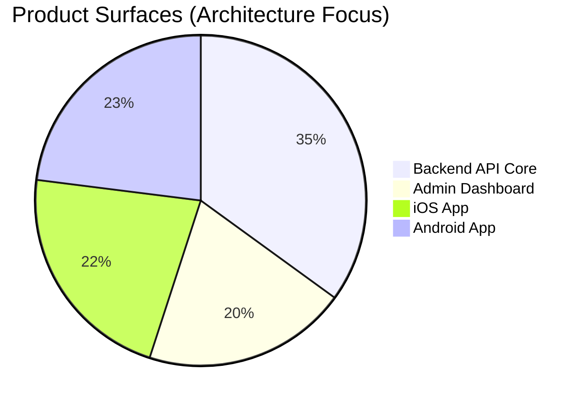

# HomeAI Architecture & Technology Brief

## 1) Executive Summary

HomeAI is a multi-surface product with:
- Mobile clients for **iOS** and **Android**.
- A **Web app** for end-users (same account/session model).
- A **FastAPI backend** that handles auth, AI orchestration, credits, subscriptions, analytics, and configuration.
- A **web Admin Dashboard** used to control providers, plans, variables, and rollout decisions without redeploying backend code.

Core design principle: keep provider, pricing, and behavior controls dynamic via admin-managed configuration and audited versioning.

## 2) High-Level Architecture

## 3) Technology Stack

| Layer | Technologies in Use |
|---|---|
| Backend API | Python, FastAPI, Pydantic, SQLAlchemy, Uvicorn, httpx, boto3 |
| AI Provider Integrations | fal.ai Queue API adapter, OpenAI Images API adapter, Mock adapter |
| Data & Persistence | SQLAlchemy ORM models; default SQLite (`app.db`), Postgres-compatible design |
| Admin Panel | Vanilla HTML, CSS, JavaScript (single-page control room), Vercel-ready deploy config |
| Web App | Vanilla HTML, CSS, JavaScript MVP (same API contracts as mobile) |
| iOS Client | Swift, SwiftUI, async/await networking (`URLSession`), XcodeGen project setup |
| Android Client | Kotlin, Jetpack Compose, Material3, Coroutines, Gradle Kotlin DSL |
| CI / Quality | GitHub Actions backend quality workflow + `make quality` (tests + compile check) |

## 4) Admin Panel Architecture

### Admin modules shipped
- API connection + health test
- Provider settings draft/publish/rollback
- Provider settings version history + audit trail
- Plans CRUD
- Variables CRUD
- Provider health table (request count, success rate, latency)
- Activity log console

### Admin-to-backend control path

## 5) Render Request Flow (Mobile -> Provider -> Result)

## 6) Key Backend Domains

- `auth`: dev login, token validation, session lifecycle
- `config`: mobile bootstrap data (active plans, variables, provider defaults)
- `ai/render-jobs`: orchestration, provider routing, status polling, cancel
- `credits`: consume/grant, balance checks, daily reset schedule support
- `subscriptions`: entitlement APIs + StoreKit/Google Play webhook stubs
- `experiments`: A/B experiment definitions, sticky assignments, and experiment audit
- `projects/discover/profile`: user board, inspiration feed, profile overview
- `admin`: provider/product management + analytics/provider-health visibility

## 7) Platform Delivery Shape

Note: chart proportions are a communication view of architecture focus (not LOC metrics).

## 8) Current Status Snapshot

- Backend orchestration and admin-control endpoints are implemented and wired.
- Admin dashboard is functional and directly connected to live backend endpoints.
- iOS and Android clients include tab-based scaffold + API-integrated core screens (`Tools`, `Create`, `Discover`, `My Profile`).
- Web app MVP now uses the same backend contracts for auth, render jobs, discover, profile, and subscriptions.
- iOS/Android/Web now share the same logical user-session pattern (`homeai_demo_user` by default, editable from profile/web UI).
- CI currently enforces backend quality checks via GitHub Actions.
