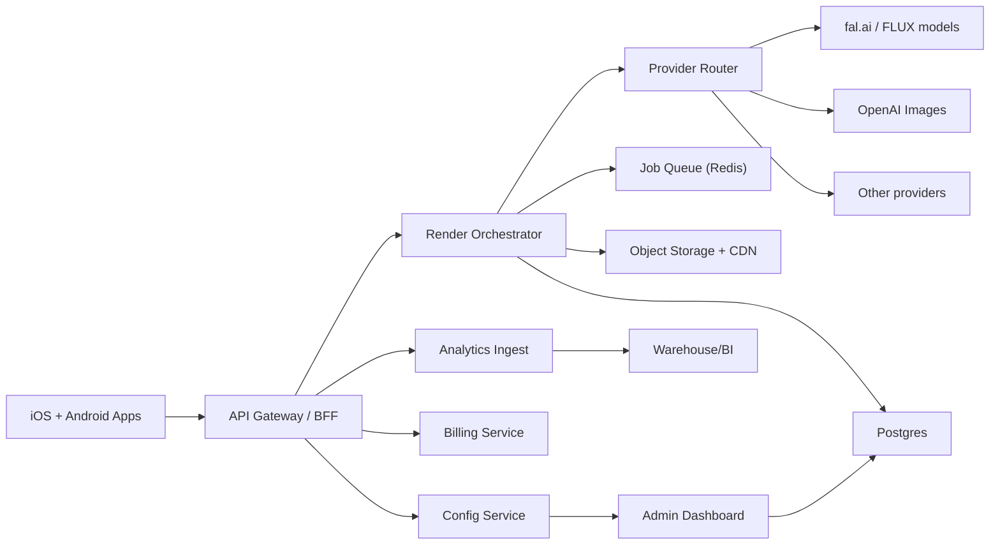

# AI Interior App - Complete UI + Backend + Delivery Plan

## 1) Product scope

Goal: ship a fast, cost-controlled AI interior redesign app for iOS and Android with an admin dashboard to control providers, models, pricing plans, experiments, and safety rules without redeploying backend code.

Primary use cases:
- Upload room photo -> choose tool/style -> generate preview -> generate final.
- Before/after compare, save, share.
- Credits/subscription paywall with daily limits.
- Discover inspiration feed and reusable style references.

## 2) App information architecture (iOS + Android)

Bottom tabs (matches your screenshots):
- Tools: core AI features list (Interior, Exterior, Garden, Paint, Floor Restyle, Reference Style).
- Create: user board/project history and saved outputs.
- Discover: inspiration feed by category.
- My Profile: subscription, credits, settings, support.

Global top actions:
- Credits badge.
- PRO button.
- Settings.

Modal surfaces:
- Daily credit limit modal.
- Upgrade paywall.
- Error/retry sheet.

## 3) UI system plan (cross-platform)

### 3.1 Design tokens
- Color tokens: `bg.primary`, `bg.card`, `text.primary`, `text.secondary`, `brand.primary`, `brand.success`, `danger`.
- Radius scale: `8/12/20/28`.
- Spacing scale: `4/8/12/16/24/32`.
- Typography scale: `titleXL`, `titleL`, `titleM`, `bodyL`, `bodyM`, `caption`.
- Elevation: `card.low`, `modal.high`.

### 3.2 Shared components
- `ImageCompareCard` (before/after split with draggable divider).
- `ToolCard` (hero image, title, subtitle, CTA).
- `CreditsChip`.
- `PrimaryButton`, `GhostButton`.
- `PaywallPlanTile` (weekly/yearly).
- `LoadingState`, `EmptyState`, `ErrorState`.
- `ProviderBadge` (for internal QA builds only).

### 3.3 Screen-by-screen specification

#### Tools tab
- Vertical feed of tool cards.
- Sections: interior/exterior/garden/reference.
- Each card has CTA `Try It`.
- Tap flow -> photo input -> style picker -> render config.

#### Create tab (Your Board)
- Grid/list toggle.
- Project cards show style label + room type + generation count + last updated.
- Tap item opens detail with before/after slider and variation actions.

#### Discover tab
- Category chips (Home, Garden, Exterior).
- Horizontal media carousels with `See All`.
- Tap inspiration -> apply as reference style in generation flow.

#### Profile tab
- Credits balance + next daily reset.
- Current plan and renewal date.
- Restore purchases / manage subscription.
- Privacy/Terms/Support/Report issue.

#### Render flow
1. Photo picker/camera
2. Precheck result (quality warnings if blurry/dark)
3. Tool-specific options (room type, style, prompt assist, mask parts)
4. Preview generation
5. Final generation (if user confirms)
6. Save/share/export

#### Paywall
- Triggered by daily limit, premium tool tap, or final render if out of credits.
- Plan selector + legal links + restore.
- A/B variants controlled by backend config.

### 3.4 Platform-specific guidance
- iOS: SwiftUI + StoreKit 2 native paywall hooks.
- Android: Kotlin + Jetpack Compose + Play Billing.
- Keep visual parity with one shared component spec and Figma tokens.

## 4) Backend architecture (flexible provider and pricing controls)

### 4.1 Core backend services
- API Gateway/BFF: auth, request validation, response shaping.
- Render Orchestrator: queue jobs, retries, provider dispatch, fallbacks.
- Config Service: dynamic variables/plans/providers/experiments.
- Billing Service: credits ledger + subscription entitlement checks.
- Analytics Ingest: event collection and KPI aggregation.

### 4.2 Dynamic config from dashboard (no redeploy)
Config domains:
- Provider config: enabled providers, default, fallback chain.
- Model routing: per operation + per image part + per tier.
- Cost guardrails: max retries, max megapixels, concurrency caps.
- Product plans: daily free credits, pro quotas, pricing metadata.
- Paywall experiments: trigger rules, copy variant, discount labels.
- Feature flags: country/platform/version rollout toggles.
- Safety policies: moderation thresholds and block rules.

### 4.3 Data model (minimum)
- `users`
- `devices`
- `subscriptions`
- `credit_ledger`
- `plans`
- `plan_entitlements`
- `projects`
- `assets`
- `render_jobs`
- `provider_attempts`
- `provider_configs`
- `feature_flags`
- `events`
- `moderation_flags`
- `ab_tests`

### 4.4 API domains
- `/v1/auth/*`
- `/v1/config/*`
- `/v1/projects/*`
- `/v1/ai/render-jobs/*`
- `/v1/credits/*`
- `/v1/subscriptions/*`
- `/v1/discover/*`
- `/v1/admin/*`
- `/v1/analytics/*`

## 5) Admin dashboard plan

Main modules:
- Provider Router
- Model Registry
- Pricing & Plans
- Credits Rules
- Experiments/A-B tests
- Safety & Moderation
- System Health
- Analytics

### 5.1 Provider Router UI
- Toggle provider on/off.
- Set default provider.
- Reorder fallback chain via drag-and-drop.
- Route by operation (`restyle/replace/remove/repaint`) and by part (`walls/floor/furniture`).
- Save as draft -> validate -> publish.

### 5.2 Plans and variables UI
- Free/pro/enterprise plan editor.
- Daily/weekly/monthly credit allowances.
- Cost per operation (preview/final).
- Country-specific pricing override table.

### 5.3 Change management
- Config versions with diff view.
- Approvals for high-impact changes (pricing/provider disable).
- Rollback to previous version in one click.
- Audit log with actor, timestamp, reason.

## 6) Analytics dashboard (key metrics)

North-star metrics:
- Activation rate: first successful preview within 24h.
- Preview->Final conversion.
- D1/D7 retention.
- Paid conversion rate.

Operational metrics:
- Job success rate (overall + provider + operation).
- P50/P95 render latency.
- Retry and failover rate.
- Cost per preview / final / active user.
- Daily credit exhaustion rate.

Business metrics:
- ARPDAU.
- Trial-to-paid and renewal rate.
- Churn rate.
- LTV/CAC proxy.

Quality metrics:
- Crash-free sessions.
- ANR rate (Android).
- Moderation false positive rate.
- User reported bad output rate.

## 7) Implementation roadmap (deep, execution-ready)

## Phase 0 - Foundation (Week 1)
- Monorepo setup, environments, CI pipeline.
- Shared API contract and OpenAPI.
- Basic auth + project schema.
- Design system token package.

Exit criteria:
- CI green on every PR.
- Local dev up in < 10 minutes.

## Phase 1 - Core generation loop (Week 2-3)
- Tools tab and render flow UI for iOS + Android.
- Backend render-jobs API + queue + job status polling.
- fal provider integration first (FLUX), OpenAI fallback adapter.
- Save project and before/after compare.

Exit criteria:
- End-to-end preview flow works on both platforms.
- Success rate >= 90% in staging load test.

## Phase 2 - Credits and paywall (Week 4)
- Credit ledger and daily reset job.
- Paywall screens and restore purchases.
- iOS StoreKit2 + Android Play Billing integration.
- Daily credit limit modal and gating rules.

Exit criteria:
- Credit accounting is idempotent and correct.
- Subscription entitlement checks pass test matrix.

## Phase 3 - Dashboard configurability (Week 5)
- Admin dashboard provider router.
- Plan editor + feature flag UI.
- Config publish/rollback + audit logs.

Exit criteria:
- Provider/model/plan changes apply without backend deploy.
- Rollback tested successfully.

## Phase 4 - Discover and growth loops (Week 6)
- Discover feeds and category pages.
- Reference-style flow into generation.
- Share cards and referral hooks.

Exit criteria:
- Discover -> Create funnel tracked with analytics events.

## Phase 5 - Reliability hardening (Week 7-8)
- Full observability (logs, traces, alerts).
- Retry/failover tuning and queue protections.
- Moderation and abuse controls.
- Performance optimization and memory audits.

Exit criteria:
- Crash-free sessions > 99.5%.
- P95 render latency within target.

## Phase 6 - Launch readiness (Week 9)
- App Store and Play Store assets + policy checks.
- Release candidate freeze and regression pass.
- Staged rollout and incident runbook.

Exit criteria:
- No P0/P1 open bugs.
- Rollout gates approved by engineering + product.

## 8) Code review and QA process (to minimize bugs)

Important: no software can be guaranteed 100% bug-free, but this process gets very close.

### 8.1 PR checklist (required)
- Small PR size (<400 lines preferred).
- Linked ticket and acceptance criteria.
- Tests added/updated.
- Backward compatibility reviewed.
- Metrics/logging added for new behavior.
- Security and privacy impact checked.

### 8.2 Review policy
- At least 2 approvals for backend and billing changes.
- At least 1 mobile + 1 backend reviewer for API contract changes.
- Mandatory architecture reviewer for provider routing or plan logic changes.

### 8.3 Test pyramid
- Unit tests: router, billing math, cost guardrails, retry logic.
- Integration tests: provider adapters, subscription webhooks, queue processing.
- Contract tests: mobile clients against OpenAPI snapshots.
- E2E tests: upload -> preview -> final -> save/share.
- Snapshot/UI tests for critical screens and paywall.

### 8.4 Release gates
- Build and lint pass.
- Unit + integration + E2E pass.
- Crash-free and ANR pre-release threshold pass.
- Cost anomaly checks pass.
- Manual exploratory checklist completed.

### 8.5 Bug triage SLA
- P0: acknowledge immediately, hotfix same day.
- P1: fix in 24h.
- P2: fix in next sprint.
- P3: backlog with product decision.

## 9) Engineering standards

- Use strict typing in backend and mobile layers.
- Idempotency keys for billing and render job creation.
- No direct provider calls from mobile apps (backend only).
- Every config change versioned and auditable.
- Feature flags for risky changes.

## 10) iOS + Android architecture recommendation

Option A (fastest): native stacks
- iOS: SwiftUI + Combine + StoreKit2.
- Android: Kotlin + Jetpack Compose + Play Billing.

Option B (shared UI): Flutter
- Faster parallel delivery but tradeoffs in native purchase/debug complexity.

Recommendation: Option A for highest subscription/payment stability and better store-compliance behavior.

## 11) Milestone deliverables

M1: working core generator in both apps.
M2: revenue-ready billing and credits.
M3: dashboard-controlled providers/plans.
M4: analytics dashboard and SLO alerts.
M5: launch candidate and staged rollout.

## 12) Immediate next implementation tasks (start now)

1. Replace provider stubs with live fal queue API calls.
2. Add Postgres migrations for settings/jobs/ledger tables.
3. Build dashboard backend endpoints for config versioning and audit logs.
4. Scaffold Android app with tabs and render flow.
5. Add analytics event schema and ingestion pipeline.
6. Implement PR template + CI quality gates.
