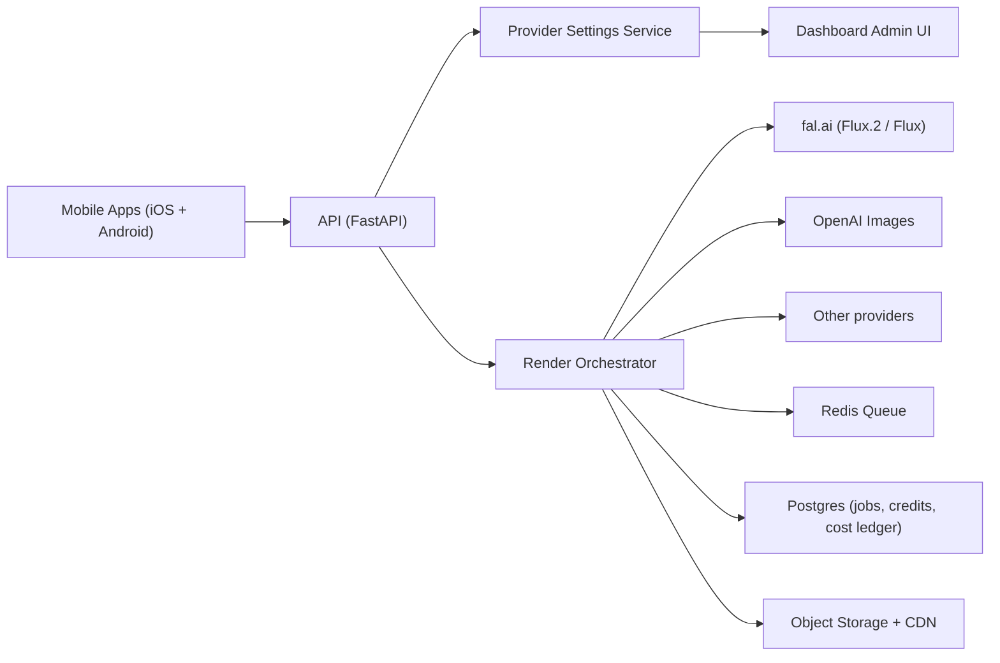

# Provider Dashboard + Google Play Plan

## 0) Architecture diagram

## 1) Dashboard settings to switch AI provider

Expose these settings in your admin dashboard and wire to `PUT /v1/admin/provider-settings`.

- `default_provider`: fallback provider if no specific route matches.
- `enabled_providers`: toggle providers on/off without deploy.
- `fallback_chain`: ordered fallback (for outages or budget spikes).
- `operation_routes`: choose provider per operation (`restyle`, `replace`, `remove`, `repaint`) for `preview` and `final`.
- `part_routes`: choose provider by edited image part (`walls`, `floor`, `furniture`, etc.).
- `provider_models`: set model IDs per provider per tier.
- `cost_controls`: retry and output resolution caps.

Recommended initial config:

- Preview: `fal` + `fal-ai/flux-1/schnell`
- Final: `fal` + `fal-ai/flux-pro/kontext`
- Fallback: `openai`
- Optional test provider: `mock`

## 2) Provider strategy (budget-first)

- Primary provider: `fal` with Flux models.
- Secondary provider: `openai` as fallback and quality tier.
- Routing rules:
  - `preview` -> cheapest reliable model
  - `final` -> higher fidelity model
  - `single-part edits` -> part-level route overrides operation route
- Guardrails:
  - Require preview before final
  - Max 1 retry
  - Limit default output to ~1MP
  - Cancel queued jobs when user abandons screen

## 3) Google Play publication plan (Android)

### Architecture

- Keep one backend for iOS + Android.
- Add Android app client (Kotlin or Flutter).
- Android app calls same APIs as iOS for render flow and billing metadata.

### Minimum Android scope

- Photo upload + style picker
- Preview/final render flow
- Before/after slider
- Credit/subscription screen
- Job polling + cancel

### Play Console and policy checklist

- Target API level requirement.
- Data safety form and in-app privacy policy link.
- User Data policy compliance (including third-party SDK disclosures).
- AI-generated content moderation and abuse reporting.
- Billing with Google Play Billing for subscriptions.
- Crash/ANR quality baseline before production rollout.

## 4) Availability check (from your competitor group)

Verified on Google Play:

- Remodel AI - Home Renovation: `ai.reimage.remodel`  
  https://play.google.com/store/apps/details?id=ai.reimage.remodel
- AI Home Design - Arch: `co.appnation.interiordesigner`  
  https://play.google.com/store/apps/details?id=co.appnation.interiordesigner
- AI Home & Garden Design - Ruma: `ruma.interiordesign`  
  https://play.google.com/store/apps/details?id=ruma.interiordesign
- Home AI: AI Interior Design: `interiordesigner.ai.decor.homedesign`  
  https://play.google.com/store/apps/details?id=interiordesigner.ai.decor.homedesign

Potentially different branding/package on Play for some iOS names (verify account owner before final benchmarking).

## 5) Implementation list (engineering)

1. Wire live fal queue adapter (submit/status/result/cancel).
2. Wire live OpenAI image adapter.
3. Add provider health checks and automatic failover.
4. Persist provider settings in Postgres.
5. Persist jobs and costs in Postgres; queue in Redis.
6. Add dashboard UI for provider/routing settings.
7. Add feature flags for per-country/provider override.
8. Add budget alarms and per-user/per-day caps.
9. Add Android client and release tracks (internal -> closed -> production).
10. Run load + cost benchmark with real prompts and masks.

## 6) Primary references for implementation

- fal Queue API docs: https://docs.fal.ai/model-endpoints/queue/
- fal FLUX.2 landing page: https://fal.ai/flux-2
- fal FLUX.2 model page: https://fal.ai/models/fal-ai/flux-2
- Google Play Developer Program Policy (includes AI-generated content section): https://support.google.com/googleplay/android-developer/answer/16528695?hl=en
- Google Play Data safety form requirements: https://support.google.com/googleplay/android-developer/answer/10787469
- Target API level requirements: https://support.google.com/googleplay/android-developer/answer/11926878?hl=en
- Play Billing subscriptions guide: https://developer.android.com/google/play/billing/subscriptions
