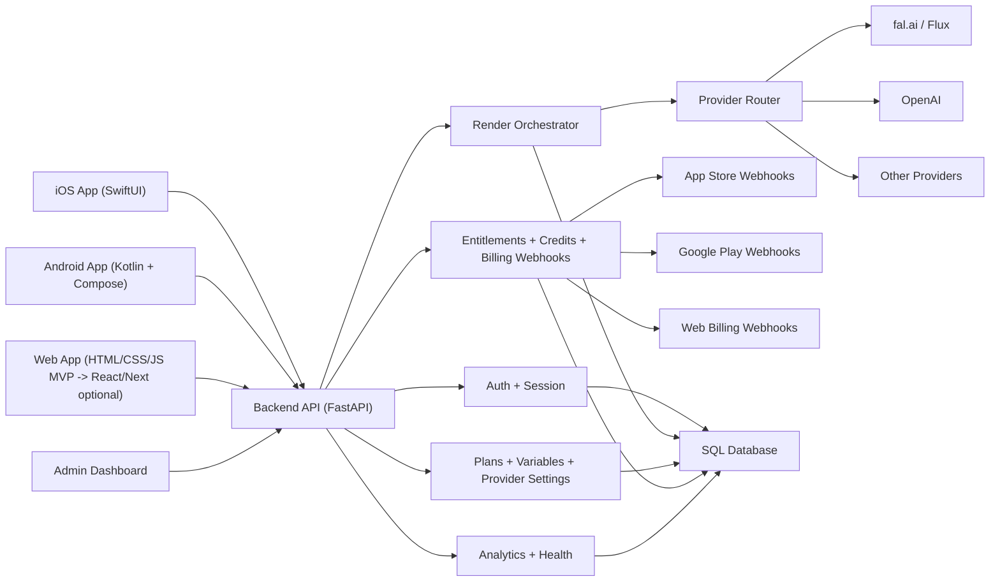

# Universal Platform Implementation Plan (iOS + Android + Web)

## 1) Target Outcome

Ship one product ecosystem where users can:
- login with the same account on iOS, Android, and Web,
- use AI tools with provider routing controlled from admin dashboard,
- hold one entitlement state regardless of purchase source (Web/App Store/Google Play),
- be measured with one analytics taxonomy.

## 2) Architecture (Execution Baseline)

## 3) Universal Code Strategy

### Current recommended (fastest to market)
- Keep existing native iOS/Android apps.
- Add Web app against same backend contracts.
- Share behavior with:
  - one API contract (`docs/api-contract-v1.md`),
  - one analytics event schema,
  - one product/provider config model in backend.

### Medium-term (higher code reuse)
- Introduce a shared SDK layer:
  - TypeScript SDK for Web + Admin.
  - OpenAPI-generated clients for Swift/Kotlin.
- Keep UI native, but share protocol and business rules centrally.

### Long-term (maximum UI reuse)
- Evaluate migration to one shared cross-platform UI stack (React Native + Web or Flutter).
- Only begin after revenue/PMF stability, because this is a large rewrite.

## 4) Implementation Work Breakdown

## Phase A: Platform Foundation (Done/In Progress)
- Auth/session endpoints with platform tag (`web`, `ios`, `android`).
- Unified profile endpoint (`/v1/profile/overview/me`).
- Unified subscription catalog + entitlement model.
- Web checkout session + web billing webhook ingestion.

## Phase B: Web App MVP (Started)
- Build web tabs: `Tools`, `Create`, `Discover`, `My Profile`.
- Integrate:
  - `/v1/auth/login-dev`, `/v1/auth/me`, `/v1/auth/logout`
  - `/v1/ai/render-jobs`, `/v1/ai/render-jobs/{id}`
  - `/v1/projects/board/me`
  - `/v1/discover/feed`
  - `/v1/profile/overview/me`
  - `/v1/subscriptions/catalog`
  - `/v1/subscriptions/web/checkout-session`
- Persist API URL + session token in browser storage.

## Phase C: Admin Power Controls (Backend + Dashboard)
- Provider routing controls by:
  - operation,
  - target image part,
  - tier (`preview`/`final`).
- Plan controls:
  - credits, pricing, `ios_product_id`, `android_product_id`, `web_product_id`.
- Variable controls:
  - paywall strategy,
  - preview-before-final policy,
  - free/pro credit reset policy.
- Audit trail for all plan/provider/variable changes.

## Phase D: Entitlement Reconciliation
- Normalize all billing events to one entitlement record per user:
  - source `ios | android | web | manual`,
  - `status`, `renews_at`, `expires_at`, `product_id`.
- Idempotent webhook processing (event ID dedupe).
- Conflict policy:
  - prefer `active` over `expired/canceled`,
  - if multiple active plans, choose highest-ranked paid plan.

## Phase E: Production Hardening
- Add image upload path (presigned upload or proxy upload) for web.
- Add queue visibility and user-facing retry UI.
- Add abuse controls (rate limits, prompt safety gates, suspicious IP checks).

## 5) Analytics Dashboard Requirements (Health + Performance)

- Funnel:
  - signup/login -> first preview -> first final -> paywall view -> checkout start -> subscription active.
- Reliability:
  - render success rate,
  - queued/in-progress/failed counts,
  - provider failure rate + fallback usage.
- Speed:
  - avg/p50/p95 latency by operation and provider.
- Cost:
  - total cost, cost per successful final, provider cost mix.
- Monetization:
  - active subscriptions by source and plan,
  - renewals due/expiring soon,
  - conversion and refund rates.
- Engagement:
  - DAU/WAU, previews per user, finals per user.

## 6) A/B Testing Scenarios (Pricing + AI Tooling)

- Pricing tests:
  - paywall timing (on exhaustion vs after first successful preview),
  - default package (weekly vs yearly highlight),
  - trial/free credit bundle size.
- AI routing tests:
  - preview model quality tier,
  - final routing strategy (fixed vs complexity-based),
  - fallback chain ordering (fal-first vs openai-first),
  - tool-specific provider maps.

Execution rules:
- Sticky assignment by `user_id`.
- Start at 10%, then 25%, then 50%.
- Guardrails: render success, p95 latency, cost-per-success, crash-free rate.
- Freeze/rollback experiment automatically if guardrails fail for 2 consecutive days.

## 7) Bug-Prevention Pipeline (Code Review + QA Gates)

Every feature PR must pass:
1. Static checks:
   - backend tests and type checks,
   - mobile compile checks,
   - web/admin JS syntax and lint checks.
2. Contract checks:
   - request/response snapshot tests for touched endpoints.
3. Reviewer checklist:
   - auth scope correctness (no cross-user leakage),
   - idempotency for billing/credits,
   - error handling for provider failures,
   - analytics events emitted for critical state changes.
4. Integration smoke:
   - login -> create preview -> poll complete -> view profile -> start checkout.
5. Release gate:
   - no P0/P1 bugs open for changed modules.

## 8) Parallel Execution Plan (Multi-Agent Friendly)

- Agent 1: web app UX + render flow + profile.
- Agent 2: backend billing/entitlement reconciliation + webhook hardening.
- Agent 3: admin controls + analytics dashboard cards.
- Agent 4: tests + CI + release checklist enforcement.

Shared rule:
- No endpoint contract changes without updating `docs/api-contract-v1.md` in same PR.
